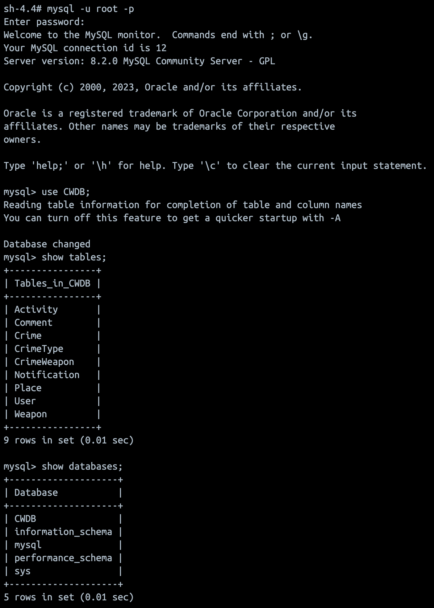
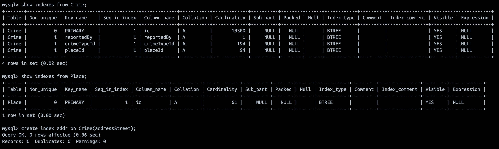
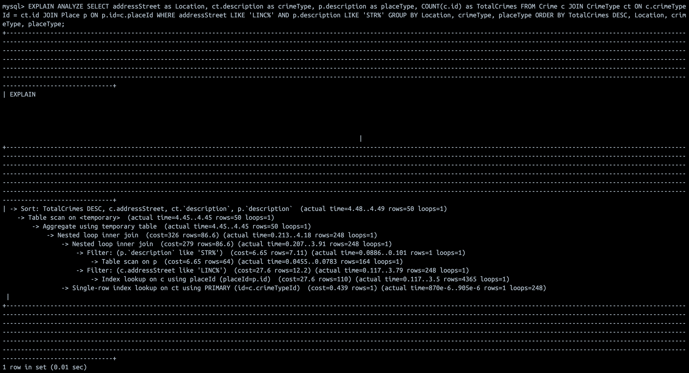
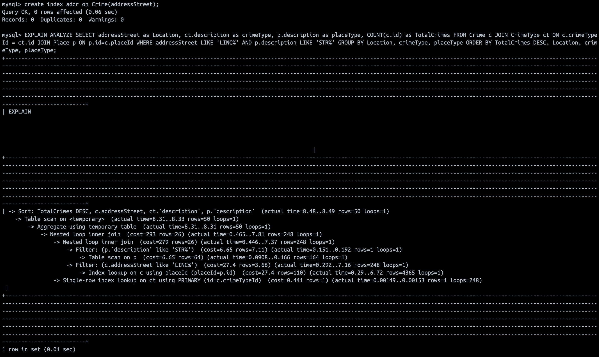
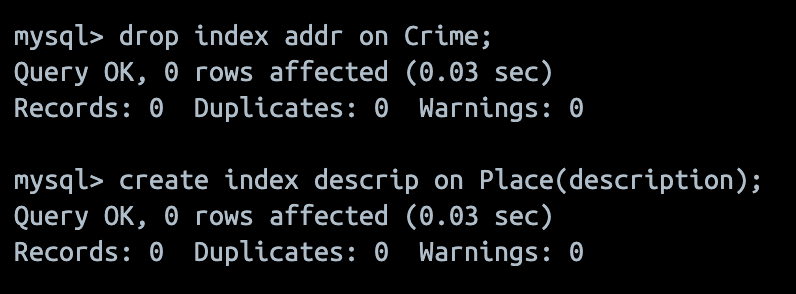
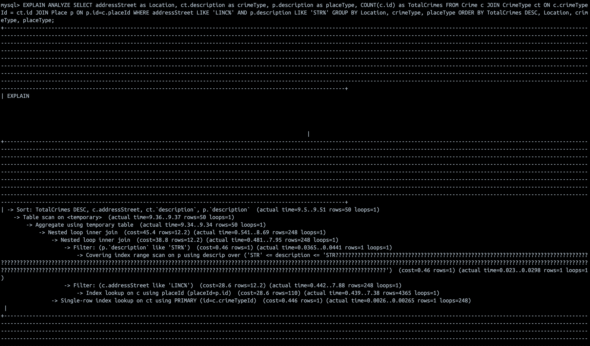
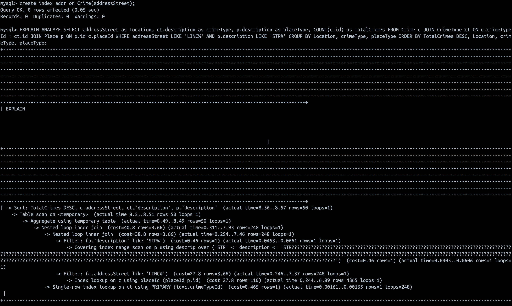

### DATABASE CONNECTION:

The name of the database we are using is **CWDB**. Following is a screenshot of connecting to this database, displaying all tables created within CWDB and the list of databases available within the MySQL instance:



### DDL COMMANDS FOR THE TABLES CREATED:

- Initializing database and using it:
    ```
    CREATE DATABASE IF NOT EXISTS CWDB;
    USE CWDB;
    ```

- User Table
    ```
    CREATE TABLE User (
    id INT AUTO_INCREMENT PRIMARY KEY,
    firstName VARCHAR(255) NOT NULL,
    lastName VARCHAR(255) NOT NULL,
    phoneNumber VARCHAR(12) NOT NULL,
    email VARCHAR(255) NOT NULL,
    password VARCHAR(100) NOT NULL,
    gender VARCHAR(10),
    houseNameWithNumberBlock VARCHAR(100) NOT NULL,
    addressStreet VARCHAR(100) NOT NULL,
    location POINT,
    createdAt TIMESTAMP DEFAULT NOW(),
    updatedAt TIMESTAMP DEFAULT NOW()
    );
    ```

- Weapon Table 
    ```
    CREATE TABLE Weapon(
    id VARCHAR(100) PRIMARY KEY,
    description VARCHAR(100)
    );
    ```

- Place Table
    ```
    CREATE TABLE Place(
    id VARCHAR(100) PRIMARY KEY,
    description VARCHAR(100)
    );
    ```

- CrimeType Table
    ```
    CREATE TABLE CrimeType(
    id VARCHAR(100) PRIMARY KEY,
    description VARCHAR(100)
    );
    ```

- Crime Table
    ```
    CREATE TABLE Crime (
    id INT AUTO_INCREMENT PRIMARY KEY,
    reportedDate DATE NOT NULL,
    reportedTime TIME NOT NULL,
    reportedBy INT NOT NULL,
    houseNameWithNumberBlock VARCHAR(100) NOT NULL,
    addressStreet VARCHAR(100) NOT NULL,
    geoCode VARCHAR(100) NOT NULL,
    crimeTypeId VARCHAR(100) NOT NULL,
    placeId VARCHAR(100) NOT NULL,
    createdAt TIMESTAMP DEFAULT NOW(),
    updatedAt TIMESTAMP DEFAULT NOW(),
    FOREIGN KEY (reportedBy) REFERENCES User(id),
    FOREIGN KEY (crimeTypeId) REFERENCES CrimeType(id),
    FOREIGN KEY (placeId) REFERENCES Place(id)
    );
    ```

- Activity Table
    ```
    CREATE TABLE Activity (
    id INT AUTO_INCREMENT PRIMARY KEY,
    crimeId INT NOT NULL,
    status VARCHAR(100),
    viewCount INT DEFAULT 0,
    createdAt TIMESTAMP DEFAULT NOW(),
    updatedAt TIMESTAMP DEFAULT NOW(),
    FOREIGN KEY (crimeId) REFERENCES Crime(id) ON DELETE CASCADE
    );
    ```

- CrimeWeapon Table
    ```
    CREATE TABLE CrimeWeapon (
    weaponId VARCHAR(100) NOT NULL,
    crimeId INT NOT NULL,
    PRIMARY KEY (weaponId, crimeId),
    FOREIGN KEY (weaponId) REFERENCES Weapon(id),
    FOREIGN KEY (crimeId) REFERENCES Crime(id) ON DELETE CASCADE
    );
    ```

- Comment Table
    ```
    CREATE TABLE Comment (
    id INT AUTO_INCREMENT PRIMARY KEY,
    crimeId INT NOT NULL,
    userId INT NOT NULL,
    body VARCHAR(1000),
    createdAt TIMESTAMP DEFAULT NOW(),
    updatedAt TIMESTAMP DEFAULT NOW(),
    FOREIGN KEY (crimeId) REFERENCES Crime(id) ON DELETE CASCADE,
    FOREIGN KEY (userId) REFERENCES User(id) ON DELETE CASCADE
    );
    ```

- Notification Table
    ```
    CREATE TABLE Notification (
    id INT AUTO_INCREMENT PRIMARY KEY,
    userId INT NOT NULL,
    activityId INT NOT NULL,
    bannerContent VARCHAR(500),
    bannerNavigation VARCHAR(500),
    createdAt TIMESTAMP DEFAULT NOW(),
    updatedAt TIMESTAMP DEFAULT NOW(),
    FOREIGN KEY (userId) REFERENCES User(id) ON DELETE CASCADE,
    FOREIGN KEY (activityId) REFERENCES Activity(id) ON DELETE CASCADE
    );
    ```

- Subscription Table
    ```
    CREATE TABLE Subscription (
    userId INT,
    crimeId INT,
    PRIMARY KEY (userId, crimeId),
    FOREIGN KEY (userId) REFERENCES User(id) ON DELETE CASCADE,
    FOREIGN KEY (crimeId) REFERENCES Crime(id) ON DELETE CASCADE
    );
    ```    

**TABLES WITH 1000 ROWS:**

The following tables currently have 1000 or more rows:

- **USER TABLE:**

    

- **CRIME TABLE:**
    
    

- **NOTIFICATION TABLE:**

    

- **COMMENT TABLE:**

    

    
### ADVANCED SQL QUERIES:

- The following is an advanced SQL Query to retrieve the location, type of crime and place and the number of crimes that match the given filter. This      query is one of the many permutations that will be leveraged in the dashboard:

    ```
    SELECT addressStreet as Location, ct.description as crimeType, p.description as placeType, COUNT(c.id) as TotalCrimes 
    FROM Crime c JOIN CrimeType ct ON c.crimeTypeId = ct.id JOIN Place p ON p.id=c.placeId 
    WHERE addressStreet LIKE 'LINC%' AND p.description LIKE 'STR%' 
    GROUP BY Location, crimeType, placeType 
    ORDER BY TotalCrimes DESC, Location, crimeType, placeType;
    ```
    **QUERY OUTPUT (TOP 15):**

    

    
    
- The following query returns all crimes matching an **ACC** description and the ones that happened at a place starting with **LINC**:

    ```
    SELECT c.id AS crime_id, c.reportedDate,c.addressStreet AS crime_location, ct.description AS crime_type, u.firstName AS reported_by_firstName,u.lastName AS reported_by_lastName,u.phoneNumber AS reported_by_phoneNumber,u.email AS reported_by_email 
    FROM Crime c JOIN CrimeType ct ON c.crimeTypeId = ct.id JOIN User u ON c.reportedBy = u.id 
    WHERE ct.id IN (SELECT id from CrimeType where description like 'ACC%') AND c.addressStreet LIKE 'LINC%' 
    ORDER BY c.reportedDate DESC;
    ```
    **QUERY OUTPUT (TOP 15):**

    

### INDEXING ANALYSIS:

#### ADVANCED QUERY 1:

This query aims to find the total number of crimes that have happened in all addresses that begin with `LINC` and place descriptions that are starting with `STR`. This query will find its use in the heatmap when users try to find out information about crime aggregates in specific areas.

Below documentation refers to the different indexing strategies we implemented for this query and reasoning for the cost seen at different levels.

**QUERY COST ANALYSIS WITH DEFAULT INDEXES:**

When analyzing the cost of executing the bare query without any indexes in place, the cost for overall query execution is **326**. 

__NO INDEXES ADDED TO THE TABLES:__



__EXPLAIN ANALYZE WITH NO INDEXES:__



__REASONING:__

- The query first completes the join between `Crime` and `CrimeType`. 
- After this join is complete, it proceeds to perform the filtering based on the where clause and then completes the join with the `Place` table. 
- Because only the primary and foreign keys are leveraged to aid in executing the query, the cost of execution seems inflated. 
- This current cost can be considered as a benchmark and further indexing can be attempted using the attributes used to filter the results as it is bound to swiften the overall data retrieval process.

**QUERY COST ANALYSIS WITH addressStreet:**

We added an index using `addressStreet` to the `Crime` table as it is one of the attributes which is used to filter the results. The cost estimation is as follows:



__REASONING:__

- When compared to the bare query with no user-defined filters, the overall cost when executing the query with `addressStreet` as one of the indexes is lowered to **293** which is about **10%**.
- Whilst this reduction is not extravagant, the minute reduction in cost can be attributed to the fact that only one of the two attributes in where clause have been aided using the index.
- The slight reduction also prompts a case for the query executing in a lob-sized manner with `addressStreet` filtering out more rows than required. This could be because a lot of values could start with **LINC** and the tuples would not match with condition given in `description` filter.

**QUERY COST ANALYSIS WITH Description:**

After deleting the index using `addressStreet`, we created a new index using `description` on `Place`.

__REMOVING PREVIOUS INDEX AND ADDING NEW ONE:__



__EXPLAIN ANALYZE USING description:__



__REASONING:__

- While adding `description` from `Place` as an index, the overall cost of execution came down by more than **80%** to **45.4**.
- This humungous reduction tends to indicate that the matching values in `description` are dissimilar.
- With cost reducing by a huge margin, it is clear that we need to use `description` as one of the indexes for this query.
- There is still room for improvement with another 20% cost reduction which is probable.

**QUERY COST ANALYSIS WITH Description AND addressStreet:**

In the final query cost analysis, we are combining the indexes created for `description` and  `addressStreet`.



__REASONING:__

- From the above image, we can see that the overall cost is **40.8**.
- In comparison with the execution with `description` as the index, the improvment is just over **10%** but in comparison with the baseline query without indexes it is almost an **85%** improvement.
- When using both attributes as indexes, the query is able to identify a middle ground when filtering out values that match both conditions - unmatched `addressStreet` with **LINC** text and `description` values that do not begin with **STR** are ignored quickly.

Based on the comparitive analysis done with applicable indexes, it is clear that a combination of `(Crime.addressStreet, Place.description)` has to be used an index to process the query with minimal overall cost.


**Query Overview:**

```
SELECT c.id AS crime_id, c.reportedDate, c.addressStreet AS crime_location, ct.description AS crime_type, u.firstName AS reported_by_firstName, u.lastName AS reported_by_lastName, u.phoneNumber AS reported_by_phoneNumber, u.email AS reported_by_email FROM Crime c JOIN CrimeType ct ON c.crimeTypeId = ct.id JOIN User u ON c.reportedBy = u.id WHERE ct.id IN (SELECT id from CrimeType where description like 'ACC%') AND c.addressStreet LIKE 'LINC%' ORDER BY c.reportedDate DESC
```

The above mentioned query aims to return the list of crimes with the crime description starting with 'ACC' that occured at places starting with 'LINC'. This is helpful to filter data that is being viewed in the application. These are just two filters that are of interest. Multiple filters can be serialized on top of this. We have taken 'addressStreet' and 'description' to experiment with indexing and its cost analysis before further filters can be added.

**Query Cost Analysis with Default Indexes:**

Below picture shows all the default indexes that are being used for this query:


The query was analyzed with default indexes Crime.id, Crime.reportedBy, Crime.crimeTypeId, Crime.placeId, CrimeType.id and produced an overall cost of 3681 as seen in the below picture:


Note the following:-
- Filter is being run on CrimeType.description to search for values starting with 'ACC'.
- Filter is being run on Crime.addressStreet to search for values starting with 'LINC'.

We use this cost as default and reference for the rest of the analysis.

**Query Cost Analysis with Index CrimeType.description:**

An index was created on top of CrimeType.description as seen in the below picture:


The query was analyzed with CrimeType.description apart from the default indexes and it produced a cost of 356 which is a 90% reduction as shown in the below picture:


The reason for the reduction in cost is that a Table scan is not being done to search for CrimeType.description starting with 'ACC'. Since there is an index, an Index Range Scan is being done which replaces the filter and also has a lower cost. But at the same time, normal filter is being applied without index range scan on top of Crime.addressStreet.

**Query Cost Analysis with Index Crime.addressStreet:**

An index was created on top of Crime.addressStreet as seen in the below picture:


The query was analyzed with Crime.addressStreet apart from the default indexes and it produced a cost of 435 which is a 88.1% reduction as shown in the below picture:


The reason for the reduction in cost is that a Table scan is not being done to search for Crime.addressStreet starting with 'LINC'. Since there is an index, an Index Range Scan is being done which replaces the filter and also has a lower cost. But at the same time, normal filter is being applied without index range scan on top of CrimeType.description.

**Query Cost Analysis with Both Indexes Crime.addressStreet and CrimeType.description:**

Both the indexes were created at the same time as seen in the picture below:


The query was analyzed with Crime.addressStreet and CrimeType.description apart from the default indexes and it produced a cost of 299 which is a 91.8% reduction as shown in the below picture:


The reason for this reduction is an index range scan is being done using the combination of both the indexes and this is the ideal optimization.The reason for the reduction in cost is that a Table scan is not being done to search for Crime.addressStreet starting with 'LINC'. Since there is an index, an Index Range Scan is being done which replaces the filter and also has a lower cost. Each row filtered using the above index will be looped over CrimeType.description values filtered by description starting with 'ACC'. Since we have index on this field also, filtering these values will also be faster thereby reducing the total cost much more compared to using a single index.

Based on the comparitive analysis done with applicable indexes, it is clear that a combination of `(Crime.addressStreet, CrimeType.description)` has to be used an index to process the query with minimal overall cost.
